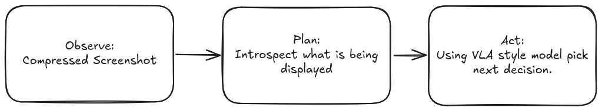
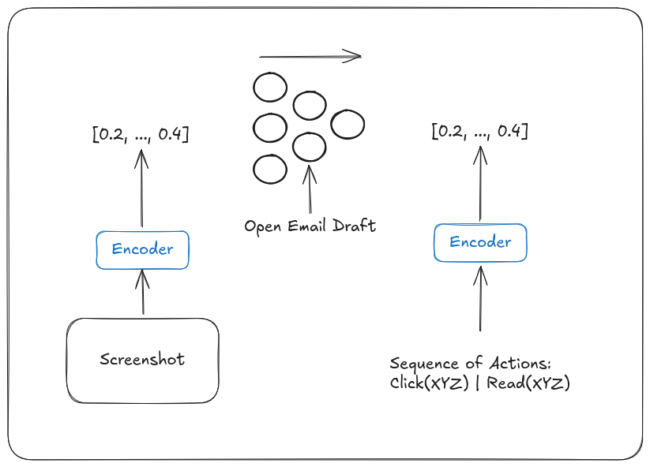
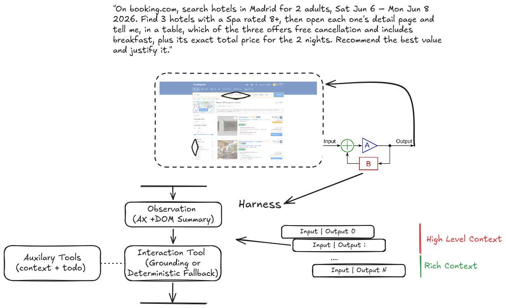
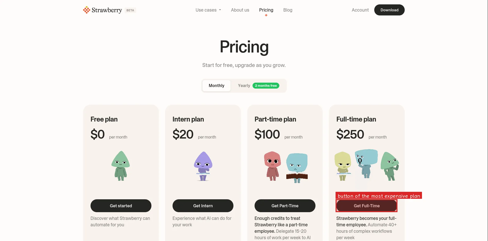

# Implementation

Building blueberry, I focused on making it a product that can add $$$ to the economy. Most people work during the day, AI can also work during the night. To embody this blueberry observes what you do, builds a graph of your behavior and sets its own goal that runs overnight.

Blueberry has two modes, normal and noir. The harness of the agent changes with the mode while keeping most of the components the same. When you start noir mode, blueberry uses all the traces it collected to build a graph of behavior analyzing where you go and what you do between pages, and turns that into a packet of instructions for the night agent to carry out.

## Harness Design
High level the harness is very simple, following a control theory loop of sense, plan and act:



The sense plan act is an approximation of something which I believe is gonna be revolutionary for browser/computer/legacy-use agents: world models and VLA powered behavior. The nature of browsing is that you see something on the web, and you use your mouse/keyboard to carry out some discrete actions in a sequence: `Click(X,Y)` and `Write(my@email.com)` so the image is the input and the sequence of actions is an output. JEPA-like models are the perfect architecture to train a model with a condition and image on what to do:



> [!IMPORTANT]
> I did not build this model for this challenge but I wanted to approximate the solution as much as possible with existing models.

After reviewing the existing code and refactoring some of the parts like the ICP an tool-use to leverage a registry-like design pattern I put together a loop which logs the events into Kafka (for deployment could be somthing else) which is then queried to build a behavior graph and compiles into instructions for the night harness. Within the harness, I made a wrapper that pushes traces into DataDog which makes understanding and observing the whole system much easier.

%here put a table of metaloop.png and events.png

The way we handle observing the actual browser I experimented with a variety of approaches of: passing just the DOM, passing full screenshots, using accessibility trees and finally landed on a hybrid which summarizes screenshots externally and passes simple dom understanding to the top level agent. Within the harness itself I added a masking feature which minimizes text in the tail of the trace as not to create multi-million token-spending agents (this is the red and green vertical higlights in the image).



### Image to Action


To make the model spend more time on thinking,planning and tool-using I added [LocateAnything](https://huggingface.co/nvidia/LocateAnything-3B) which is the end-effector of the model that can take a semantic description and turn it into an action on the website and most importantly, if we run something for a full night, it runs locally with just 3-billion parameters. This can take the bulk of the work of clicking and pointing and even OCR on any screenshot. In the sample above we can even see its semantic understanding of highlighting the button with the most expensive plan.


# Blueberry Browser

> **⚠️ Disclaimer:** I'm not proud of this codebase! It was built in 3 hours. If you have some time left over in the challenge, feel free to refactor and clean things up!

https://github.com/user-attachments/assets/bbf939e2-d87c-4c77-ab7d-828259f6d28d

---

## Overview

You are the **CTO of Blueberry Browser**, a Strawberry competitor. Your mission is to add a feature to Blueberry that makes it superior & more promising than Strawberry.

But your time is limited—Strawberry is about to raise a two billion dollar Series A round from X-Separator, B17Å and Sequoiadendron giganteum Capital.

## 🎯 Task

Your job is to **clone this repo** and add a unique feature. Some ideas are listed below.

It doesn't need to work 100% reliably, or even be completely done. It just has to:

- Show that you are creative and can iterate on novel ideas fast
- Demonstrate good system thinking and code practices  
- Prove you are a capable full stack and/or LLM dev

Once you're done, we'll book a call where you'll get to present your work!

If it's cracked, we might just have to acquire Blueberry Browser to stay alive 👀👀👀

### ⏰ Time

**1-2 weeks** is ideal for this challenge. This allows you to work over weekends and during evenings in your own time.

### 📋 Rules

You are allowed to vibe code, but make sure you understand everything so we can ask technical questions.

## 💡 Feature Ideas

### **Browsing History Compiler**
Track the things that the user is doing inside the browser and figure out from a series of browser states what the user is doing, and perhaps how valuable, repetitive tasks can be re-run by an AI agent.

*Tab state series → Prompt for web agent how to reproduce the work*

### **Coding Agent**
Sidebar coding agent that can create a script that can run on the open tabs.

Maybe useful for filling forms or changing the page's style so it can extract data but present it in a nicer format.

### **Tab Completion Model**
Predict next action or what to type, like Cursor's tab completion model.

### **Your Own Idea**
Feel free to implement your own idea!

> Wanted to try transformers.js for a while? This is your chance! 

> Have an old cool web agent framework you built? Let's see if you can merge it into the browser!

> Think you can add a completely new innovation to the browser concept with some insane, over-engineered React? Lfg!

Make sure you can realistically showcase a simple version of it in the timeframe. You can double check with us first if uncertain! :)

## 💬 Tips

Feel free to write to us with questions or send updates during the process—it's a good way to get a feel for working together.

It can also be a good way for us to give feedback if things are heading in the right or wrong direction.

---

## 🚀 Project Setup

### Install
```bash
$ bun install
```

### Development
```bash
$ bun dev
```

**Add an OpenAI API key to `.env`** in the root folder.

Strawberry will reimburse LLM costs, so go crazy! *(Please not more than a few hundred dollars though!)*
